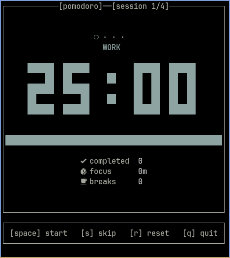

# 🍅 pomodoro-rs

A minimal, keyboard-driven Pomodoro timer for the terminal — built with Rust and [Ratatui](https://ratatui.rs)



## Features

- **Pixel-font clock** — large block-character digits that scale with your terminal height
- **Three phases** — Work, Short Break, and Long Break with automatic transitions
- **Session tracking** — dot indicators show progress through the current cycle
- **Live stats** — completed pomodoros, total focus time, and break count
- **System notifications** — native desktop alerts when each phase ends (macOS, Linux, Windows)
- **Fully responsive** — layout adapts to any terminal size
- **Zero config** — sane defaults, just run and go

## Install

### From source

```bash
git clone https://github.com/lvntcnylmz/pomodoro-rs
cd pomodoro
cargo build --release
./target/release/pomo-rs
```

### Requirements

- Rust 1.75+
- A [Nerd Font](https://www.nerdfonts.com/) for stats icons (optional — falls back gracefully)
- `notify-send` on Linux for desktop notifications

## Usage

| Key         | Action             |
| ----------- | ------------------ |
| `Space`     | Start / Pause      |
| `s`         | Skip current phase |
| `r`         | Reset everything   |
| `q` / `Esc` | Quit               |

## Defaults

| Setting                  | Duration |
| ------------------------ | -------- |
| Work                     | 25 min   |
| Short break              | 5 min    |
| Long break               | 15 min   |
| Cycles before long break | 4        |

## Project structure

```
src/
├── main.rs   — event loop & entry point
├── app.rs    — state, logic, and phase transitions
└── ui.rs     — terminal rendering (Ratatui)
```
